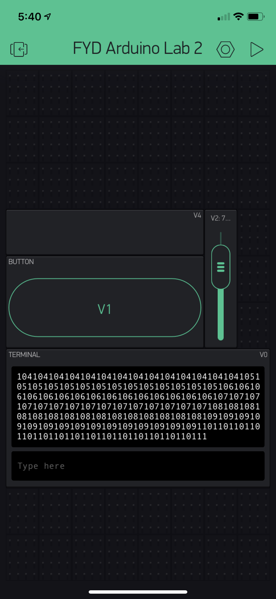

Name: Adrian HInojosa

EID:afh663

Team Number: 8

## Questions

1. What is the purpose of an IP address?

    IP addresses allow computer to be individualized on the internet.

2. What is a DNS? What are the benefits of using domain names instead of IP addresses?

    Domain name system. Allows humans to memorize word addresses instead of a string of numbers.

3. What is the difference between a static IP and a dynamic IP?

    Static IP stays the same while dynamic IP can change when it accesses different servers.

4. What is the tradeoff between UDP and TCP protocols?

    UDP is faster but less secure.

5. Why can't we use the delay function with Blynk?

    It will mess with blynk's event based processing.

6. What does it mean for a function to be "Blocking"?

    Doesn't allow other stuff to run.

7. Why are interrupts useful for writing Non-Blocking code?

    Interupts allow other code to run while the interupt is not needed.

8. What is the difference between interface and implementation? Why is it important?

   Interface is the structure and implementation is how it actually happens. Its important because a good structure makes a better implementation.

9. Screenshot of your Blynk App:

    
